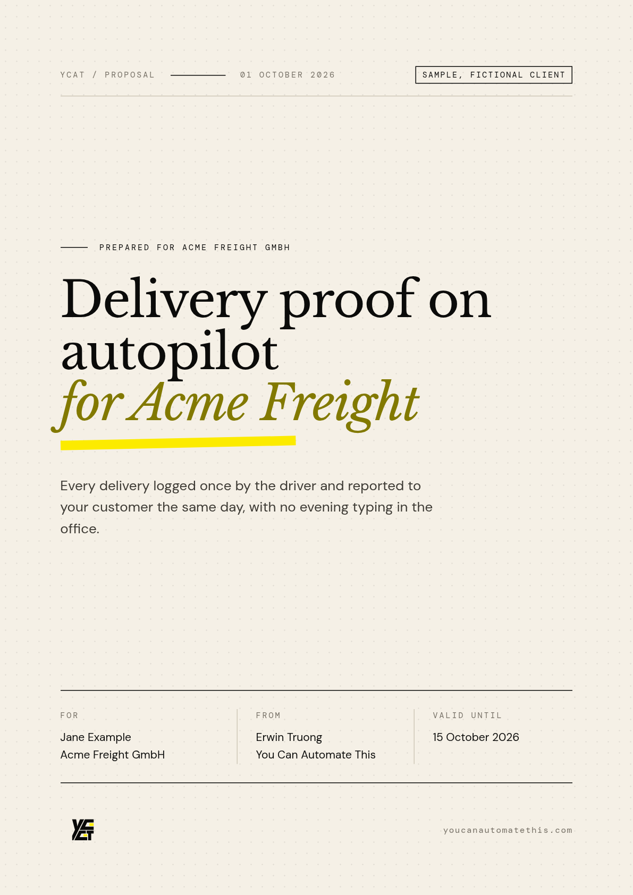
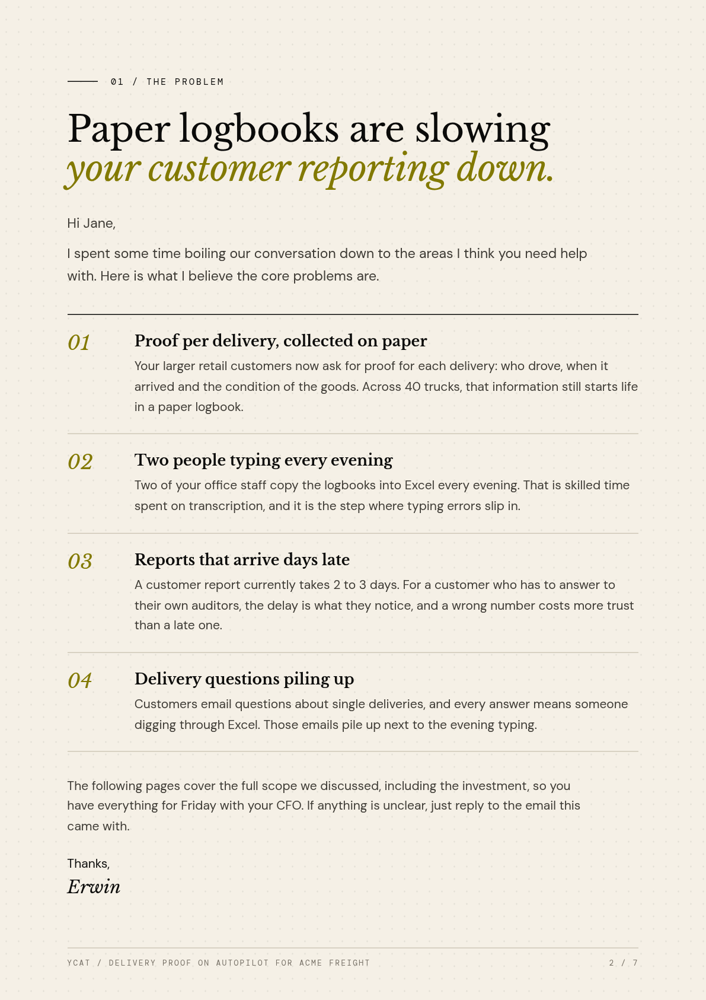
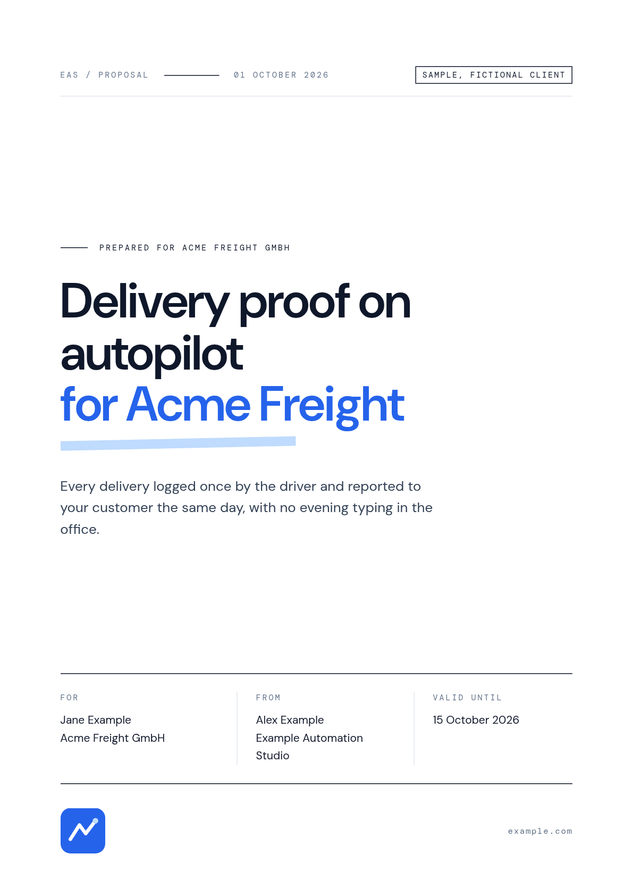
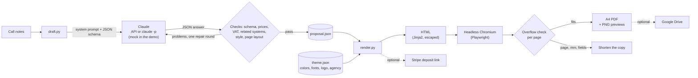

# proposal-pdf-engine

Discovery-call notes in, a branded proposal PDF out: proposal, services agreement and deposit invoice
in one A4 document.

This is a sanitized rebuild of the proposal system I use in my automation agency, You Can Automate
This (YCAT). Claude drafts a structured `proposal.json` from my call notes, code checks it, and
headless Chromium renders it in my brand. Real mode can add a Stripe deposit link and upload the PDF
to Google Drive.

The demo runs offline with a fictional client. No account or API key needed.

<p>
  
  
  
</p>

## The problem

After a sales call, the proposal is slow to write and easy to get wrong. It has to restate the
client's problem in their words, describe the solution, list countable deliverables, set a timeline,
price it, add terms and ask for a deposit.

A language model writes the copy well. It should not decide prices, tax or legal text, though, and a
fixed-size PDF template breaks quietly when the copy runs long. So this project splits the job: the
model writes words, code owns everything that has to be right.

## What it does

- **`draft.py`**: notes to `proposal.json`. Claude writes the copy (Anthropic API or `claude -p`).
  Code then checks the answer: the schema, every price against the notes, VAT from a rule table,
  related systems against a verified list, house style (no em or en dashes, no placeholders) and the
  page layout. Failed checks go back to the model once, with the exact problems. If the notes miss
  the price, the client's name or company, or the client's country, it asks instead of guessing.
- **`render.py`**: `proposal.json` to HTML to an A4 PDF. Pages: cover, the problem, the solution,
  scope and timeline, investment, services agreement, deposit invoice. Every page is measured for
  overflow. A page that does not fit fails the render with the page number, the overflow in mm and
  the fields to shorten.
- **Themes**: `themes/<name>/theme.json` sets colors, fonts, logo and the agency details. Two ship:
  `ycat` (my brand, the default) and `neutral`.
- **Real mode, behind flags**: `--stripe` creates a Stripe payment link for the deposit,
  `--drive` uploads the PDF to Google Drive.

## Architecture



## Quickstart (offline demo)

```bash
cd proposal-pdf-engine
python3 -m venv .venv && . .venv/bin/activate
pip install -r requirements-dev.txt
python -m playwright install chromium   # or: export PROPOSAL_CHROMIUM=/usr/bin/chromium
python demo.py
pytest -q
```

`make setup`, `make demo` and `make test` do the same.

The demo drafts `proposal.json` from `examples/acme-freight/notes.md` with the mock drafter (it
replays a recorded model answer, then runs every check a live draft gets), renders the PDF in both
themes, shows the overflow check catching a deliberately overlong section, and prints the Stripe
request real mode would send. Output from a run:

```text
== 1/5 draft: call notes -> proposal.json (mock drafter, offline)
   client:  Jane Example, Acme Freight GmbH (DE)
   checks:  schema, house style, prices from the notes, VAT rule, related systems, page layout: ok
   VAT:     VAT 19% (from the rule table, not from the model)
   totals:  total €5,712.00 incl. VAT 19% €912.00, net €4,800.00 | deposit 50% €2,856.00, balance €2,856.00
   wrote:   out/acme-freight/proposal.json (same as examples/acme-freight/proposal.json: yes)

== 2/5 render: proposal.json -> PDF (YCAT theme) + README previews
   pages:   7 sections, 7 PDF pages
   layout:  no overflow (tightest: page 2, 12.0 mm to spare)
   fonts:   all loaded
   pdf:     out/sample-proposal.pdf
   preview: docs/preview-page-1.png
   preview: docs/preview-page-2.png

== 3/5 theme: the same proposal in the neutral theme
   layout:  no overflow (tightest: page 2, 12.0 mm to spare)
   pdf:     out/sample-proposal-neutral.pdf
   preview: docs/preview-neutral-page-1.png

== 4/5 overflow check: 14 scope items of two lines each (expected to fail)
   caught:  page 4 (Scope and timeline) overflows by 92.3 mm, last visible text: "I aim to deliver ahead of this. The one thing that can move it is acce". Shorten: scope.intro, scope.items, scope.outro, milestones.items, milestones.note
   result:  the overlong section was reported

== 5/5 stripe: the deposit-link request real mode would send (nothing is sent)
   product:  Delivery proof on autopilot for Acme Freight - 50% deposit
   price:    285600 eur (minor units)
   retry-safe id: proposal-acme-freight-20261001-EUR-285600 (Stripe idempotency)

Demo finished: open out/sample-proposal.pdf
```

## Real mode

1. `cp .env.example .env` and fill in only what you use.
2. `pip install -r requirements-real.txt`
3. Draft from your notes:

   ```bash
   python draft.py my-call.md --backend anthropic     # ANTHROPIC_API_KEY, model from PROPOSAL_MODEL
   python draft.py my-call.md --backend claude-cli    # uses your Claude Code login instead
   ```

   It writes `out/<client>/proposal.json`, or prints questions and writes nothing (exit code 2).
4. Read the JSON. Check the price, the VAT line and anything the model inferred.
5. Render, and optionally create the deposit link and upload:

   ```bash
   python render.py out/<client>/proposal.json --check            # validate and print totals
   python render.py out/<client>/proposal.json --stripe-dry-run   # see the Stripe request, send nothing
   python render.py out/<client>/proposal.json --stripe --drive --share
   ```

`--stripe` needs a restricted key with write access to Products, Prices and Payment Links. The link
is written back into `proposal.json`, so the next render reuses it. `--drive` uses the `drive.file`
scope, puts the PDF in `Proposals/<client>/`, and is skipped when the layout check fails (unless you
pass `--allow-overflow`). `--share` makes the file viewable by anyone with the link.

Your own brand: copy `themes/neutral` to `themes/private/<name>` (ignored by git) or to any folder
outside the repo, edit `theme.json` and the logo, and pass `--theme <that folder>`. Font stylesheets
starting with `@fonts/` point at the fonts shipped in this repo, so they keep working from anywhere.

| Exit code | `render.py` | `draft.py` |
|---|---|---|
| 0 | PDF written, every page fits | `proposal.json` written |
| 1 | invalid proposal or theme | the draft failed its checks after the repair round |
| 2 | a page overflows (PDF still written for inspection) | the notes are missing information |
| 3 | browser or render error | backend error |
| 4 | an integration failed (PDF written) | |

## proposal.json

The full example is [`examples/acme-freight/proposal.json`](examples/acme-freight/proposal.json).
Top-level keys, in document order:

| Key | What it holds |
|---|---|
| `client` | first and last name, company, email, ISO country code, optional address and VAT ID |
| `title`, `title_accent`, `subtitle` | the cover |
| `problem`, `solution` | headline, intro, 1 to 6 numbered items, outro |
| `scope`, `milestones` | countable deliverables; phases with durations |
| `related` | optional, systems from the theme's verified list |
| `pricing` | line items (net price, quantity), running costs the client pays directly |
| `vat` | rate and label, set by the VAT rule table when drafting |
| `payment_terms` | deposit percentage, invoice due days |
| `mode` | `direct` (deposit invoice, payment link) or `marketplace` (payments run through e.g. Upwork) |
| `date`, `valid_days`, `deposit_link`, `invoice_number`, `slug`, `sample` | set by code or by hand |

Copy fields accept blank lines for paragraphs, `**bold**` and `*italic*`. Everything else is escaped.

## Project layout

```text
proposal-pdf-engine/
├── render.py                  proposal.json -> HTML -> PDF, overflow check, --stripe, --drive
├── draft.py                   call notes -> proposal.json (mock, anthropic or claude-cli backend)
├── demo.py                    offline demo, writes out/ and docs/
├── proposal_engine/
│   ├── schema.py              pydantic models + house-style lint
│   ├── money.py               Decimal totals, VAT, deposit and balance, minor units
│   ├── theme.py               theme.json loading and CSS variables
│   ├── document.py            page plan + Jinja2 rendering
│   ├── overflow.py            per-page overflow measurement (runs in the page)
│   ├── pdf.py                 Playwright: PDF, measurement, PNG previews
│   ├── drafting.py            prompts, backends, checks, repair round
│   ├── pipeline.py            glue + the layout checker the drafter uses
│   ├── prompts/draft_system.md
│   ├── templates/             proposal.html.j2, proposal.css
│   └── integrations/          stripe_deposit.py, drive_upload.py
├── themes/                    ycat/ (default), neutral/
├── fonts/                     DM Sans, DM Mono, Libre Baskerville + OFL licenses
├── examples/acme-freight/     fictional notes, recorded model answer, expected proposal.json
├── tests/                     pytest, browser tests skip when no Chromium is available
└── docs/                      README previews
```

## Design decisions worth noticing

- **The model writes words, code owns numbers.** Every price has to appear in the notes (both
  `4,800` and `4.800,00` styles are read), or the draft fails. VAT comes from a rule table keyed on
  the client's country. Totals use `Decimal` with half-up rounding. The deposit is computed from the
  net amount and VAT added on top, so the invoice's net and VAT lines are exact and deposit plus
  balance always equals the total to the cent (tested over 120 amount, rate and percentage
  combinations).
- **Layout is a check, not a hope.** Each page is a fixed-height A4 section with overflow hidden,
  so too much text would be cut off without an error. The checker measures every element in the live
  layout (clipped elements still report their position) against the top of the footer. The drafter
  gets the same report in its repair round, so the model shortens its own copy.
- **One schema, two uses.** The pydantic models that validate `proposal.json` also produce the JSON
  schema for structured output. Keywords the API does not accept are stripped from the copy sent to
  the model and still enforced locally. The model only ever writes the body: date, VAT, links and
  invoice number are not in its schema.
- **Ask, don't guess.** When the notes lack the price, company, first name or country, the prompt
  tells the model to return questions instead of a proposal (exit code 2, no file). Code backs this
  up: an invented price or a missing country fails the draft, so neither reaches a file.
- **Model output is untrusted input.** Jinja2 autoescapes everything; only paragraphs, bold and
  italic become markup. Theme values that go into CSS are checked for characters that could close a
  rule, and a deposit link must be `https://`.
- **Marketplace mode** drops the off-platform payment link and the invoice page, and the agreement
  points to the marketplace's payment terms.
- **Idempotent side effects.** Stripe calls carry idempotency keys derived from the proposal and the
  amount, and an existing link is reused. A PDF that fails the layout check is not uploaded.
- **Offline and reproducible.** Fonts ship with the repo, the demo uses a fixed date, and the mock
  drafter goes through the same checks as a live one. A test asserts that the demo draft equals the
  committed example.

## Limitations

- Fixed labels and the agreement text are English only.
- The VAT rule table covers B2B sales by an EU-based agency. For anything else, set `vat` by hand.
  None of this is tax or legal advice: the services agreement is a template to review.
- Currencies: EUR, USD, GBP and CHF.
- Invoice numbers default to `D-<date>-<client>`. Where the law asks for a gapless sequence, set
  `invoice_number` from your bookkeeping.
- One page per section. A section that does not fit has to be shortened; it never flows onto a
  second page.
- The live paths (Anthropic API, `claude -p`, Stripe, Drive) are covered by tests with stubs and
  fakes. The demo does not call them.

## Fonts and brand assets

- **DM Sans** and **DM Mono**: SIL Open Font License 1.1, Latin and Latin Extended subsets as served
  by Google Fonts. License texts in `fonts/dm-sans/OFL.txt` and `fonts/dm-mono/OFL.txt`.
- **Libre Baskerville**: SIL Open Font License 1.1 with the Reserved Font Name "Libre Baskerville".
  Because of the reserved name, the repo ships the unmodified upstream files from the
  [google/fonts](https://github.com/google/fonts/tree/main/ofl/librebaskerville) repository instead
  of subsets. License text in `fonts/libre-baskerville/OFL.txt`.
- A theme can also load fonts from a stylesheet URL such as Google Fonts (`fonts.stylesheets` in
  `theme.json`). That needs network access at render time.
- The YCAT name and logo in `themes/ycat/` are my brand and are not covered by the MIT license.

## License

Code: MIT, see [LICENSE](LICENSE). Fonts: SIL Open Font License 1.1. YCAT name and logo: all rights
reserved.
